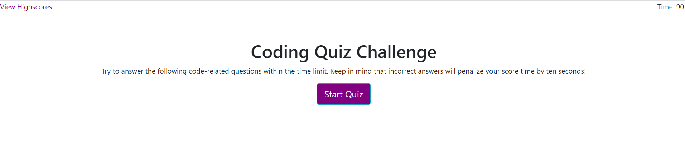

# homework4_codequiz

## Purpose of Code Quiz

The purpose of this excercise is to create a multiple choice quiz with a 90 second timer. On start, the timer begins countdown. If the user selects the correct answer, the next question will appear. If the incorrect answer is selected, ten seconds is deducted from the timer until the user either selects the correct answer and/or the timer ends at 0 seconds. At finish, the score (time remaining) is shown to the user with an input text to enter initials and then to submit to the score page.

## Overall Experience

This homework was really difficult for me because I kept getting a lot of syntax errors even with the bracket colorizer. Once we started jQuery, I found it harder to use getElementID in the js file and found myself fighting want to use jquery in the html file. With that said, I wasn't able to complete as much as I wanted within this homework.

## Sources

- Watched again all Javascript and Web API course videos
- Reviewed all activties from week 4
- Utilized W3Schools(https://www.w3schools.com/js/js_htmldom_eventlistener.asp)
- Reviewed hide attributes (https://developer.mozilla.org/en-US/docs/Web/HTML/Global_attributes/hidden)

